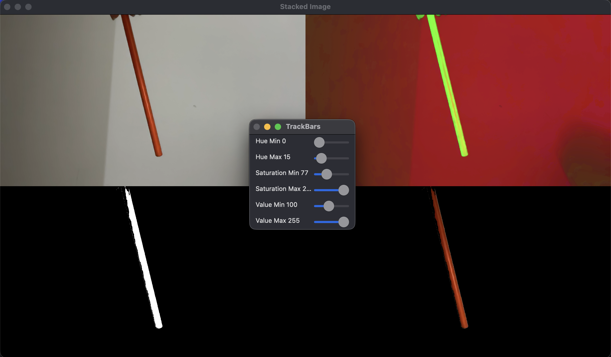
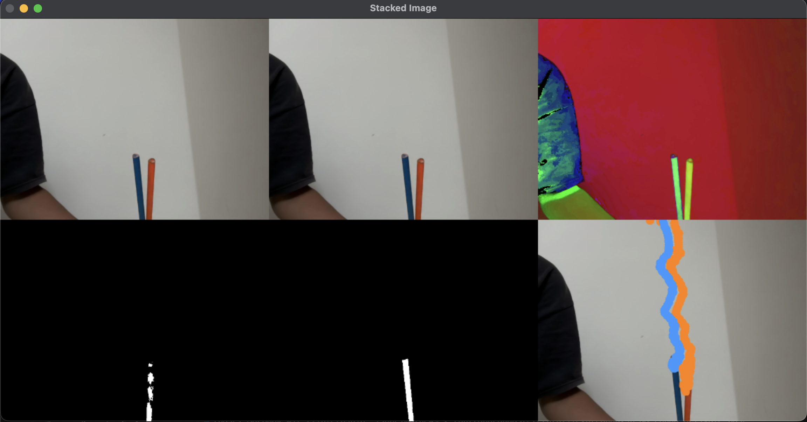
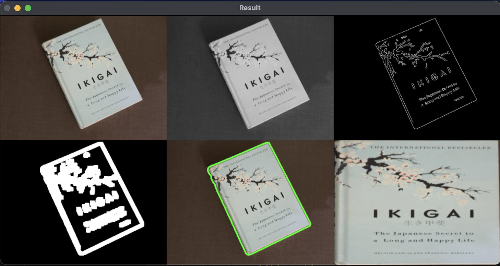
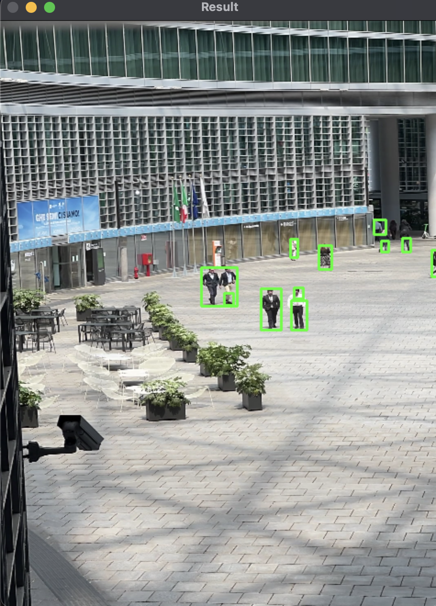

# computer-vision-fundamentals
Collection of OpenCV projects covering computer vision and image processing fundamentals

## Projects

### 1. Color Detection
- Real-time colour detection using HSV colour space.
- Interactive threshold adjustment using OpenCV trackbars.
- Object highlighting based on selected colour ranges.


### 2. Virtual Painter
- Hand-controlled drawing application using colour tracking.
- Real-time object detection and trajectory visualisation.
- Multi-colour drawing support.


### 3. Document Scanner
- Automatic document detection using contour analysis and perspective transformation
- Perspective transformation to obtain a top-down scanned view.
- Image enhancement using thresholding and adaptive preprocessing.


### 4. Motion Detection
- Background subtraction using frame differencing.
- Morphological operations to reduce image noise.
- Detection and tracking of moving objects.


## Technologies Used

- Python
- OpenCV
- NumPy

## Learning Outcomes

Through these projects, I gained practical experience with:

- Image preprocessing techniques
- Contour and edge detection
- Colour space transformations
- Geometric transformations
- Morphological image operations
- Motion detection
- Real-time video processing
- OpenCV application development

These concepts provided the foundation for larger computer vision projects, including a real-time PPE Compliance Monitoring System using YOLO11 and ByteTrack.

## Requirements

Install the required packages:

```bash
pip install opencv-python numpy
```

